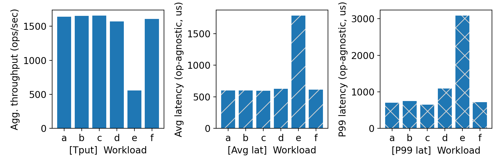
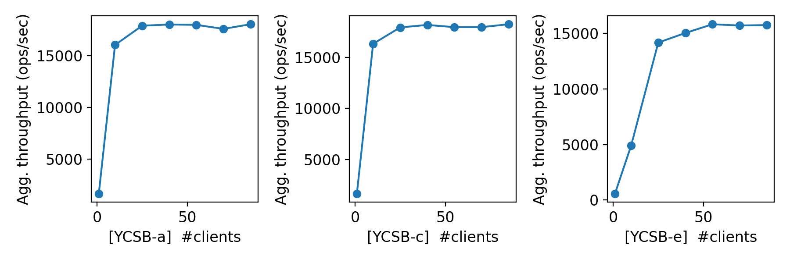
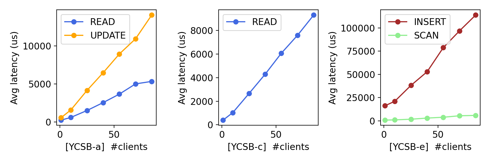

# CS 739 MadKV Project 1

**Group members**: Devesh Maheshwari `dmaheshwar22@wisc.edu`, Cole Bollig `cabollig@wisc.edu`

## Design Walkthrough

We implemented a simple client/server KVStore in c++ using the
gRPC library to handle RPC stub creation. The server is a simple
single threaded process that handles client RPCs to manage a map
of strings. The simple client that reads commands from standard
input and executes the associated RPC to the server. We implemented
the following RPCs:

1. PUT: Store key/value pair
   1. Client request message \{Key: string, Value: string\}
   2. Server response message \{Key-Found: boolean\}
2. SWAP: Store key/value pair and return old value
   1. Client request message \{Key: string, Value: string\}
   2. Server response message \{Key-Found: boolean, Old-Value: string\}
3. GET: Recieve stored keys value
   1. Client request message \{Key: string\}
   2. Server response message \{Key-Found: boolean, Value: string\}
4. SCAN: Return key/value pairs within specified key range
   1. Client request message \{Range-Begin: string, Range-End: string\}
   2. Server response message \[\{Key: string, Value: string\} ... \{Key: string, Value: string\}\] (vector of key/value pairs)
5. DELETE: Remove key from store
   1. Client request message \{Key: string\}
   2. Server response message \{Key-Found: boolean\}

## Self-provided Testcases

<u>Found the following testcase results:</u> 1, 2, 3, 4, 5

You will run some testcases during demo time.

### Explanations

1. Test 1 verifies the basic functionality of each RPC command with
   a single client and server.
2. Test 2 checks basic RPC functionality with non-existent key references
   with a single client and server.
3. Test 3 concurrently runs two clients talking to one server. These clients
   both run three PUT, one GET, and one SCAN RPCs on non-colliding keys.
4. Test 4 concurrently runs two clients talking to one server such that
   client 1 writes to a key, client two writes a new value to the same key,
   and both clients run the GET RPC on the shared key.
5. Test 5 concurrently runs two clients talking to one server testing the
   SWAP, SCAN, and DELETE RPCs on a shared key.

## Fuzz Testing

<u>Parsed the following fuzz testing results:</u>

num_clis | conflict | outcome
:-: | :-: | :-:
1 | no | PASSED
3 | no | PASSED
3 | yes | PASSED

You will run a multi-client conflicting-keys fuzz test during demo time.

### Comments

Single-client fuzz passed as expected — just sequential correctness with random ops. 3-client no-conflict also passed since clients hit disjoint keys, so no contention. The interesting one is 3-client with conflicts: concurrent ops on overlapping keys all passed, meaning the mutex on the server properly serializes access and every GET returns a value consistent with some valid ordering of all PUTs/DELETEs on that key.

## YCSB Benchmarking

<u>Single-client throughput/latency across workloads:</u>

<u>Agg. throughput trend vs. number of clients:</u>

<u>Avg. latency trend vs. number of clients:</u>

### Comments

**Single-client:** Workloads A–D and F all hit ~1600 ops/sec with ~600μs avg latency, which makes sense — they're all point operations (gets, puts, swaps) and the bottleneck is just the network RTT. Workload E is the outlier at ~550 ops/sec and ~1700μs avg latency because scans iterate over key ranges, so each op is fundamentally more expensive. P99 tells a similar story: A–C stay around 750μs, D is slightly higher at ~1050μs (latest-record distribution creates some hot-spotting), and E spikes to ~3100μs due to variable scan range sizes.

**Throughput scaling:** All three workloads show a sharp jump from 1 to 10 clients (gRPC thread pool gets saturated with useful work), then plateau. YCSB-A and C both cap around 18K ops/sec. YCSB-E plateaus around 15-16K ops/sec — lower because scans hold the mutex longer than point ops. The flat line after 25 clients means we've hit server-side saturation (the single mutex becomes the bottleneck).

**Latency scaling:** Latency grows roughly linearly with client count across all workloads — classic queuing behavior. For YCSB-A, READ and UPDATE track each other closely, going from ~500μs to ~4700μs at 85 clients. YCSB-C (pure reads) shows a similar linear trend up to ~4500μs. For YCSB-E, INSERT latency starts at ~1000μs and SCAN at ~1500μs; both grow to ~4500-5000μs. The linear growth combined with the throughput plateau confirms the server is the bottleneck — it processes ops at a fixed rate while clients queue up.

## Additional Discussion

Our server uses a single global `std::mutex` which trivially guarantees linearizability — every operation is fully serialized. This is correct but limits scalability: the throughput plateau around 18K ops/sec is the mutex bottleneck. A reader-writer lock (`std::shared_mutex`) could improve read-heavy workloads like YCSB-C by allowing concurrent reads, and a sharded/partitioned lock scheme could help across all workloads. We chose simplicity for P1 since correctness matters more than peak throughput at this stage.