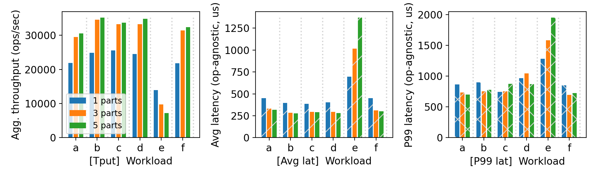
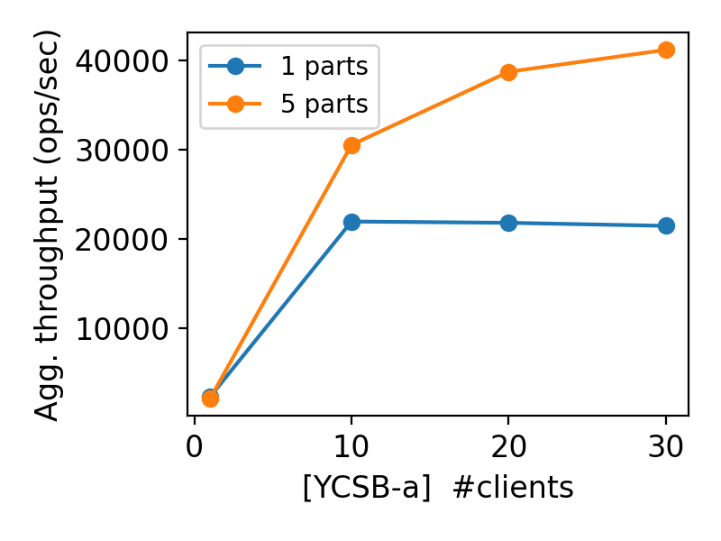

# CS 739 MadKV Project 2

**Group members**: Devesh Maheshwari `dmaheshwar22@wisc.edu`

## Design Walkthrough

Our implementation uses three components: a cluster manager, multiple KV servers, and clients. The manager is launched first with a list of server addresses and assigns each server a partition ID equal to its server ID. Clients query the manager once on startup to get the full partition map, then connect directly to all servers.

For durability, each server maintains a SQLite-based write-ahead log (WAL) under its backer_path directory. Every mutating operation (Put, Swap, Delete) writes to the WAL before modifying the in-memory map and acknowledging the client. On restart, the server replays the WAL in order to reconstruct the in-memory state.

Partitioning uses std::hash<string>(key) % N to route each key to a server. This is a simple hash-based static partitioning — each server owns exactly 1/N of the keyspace. Scans fan out to all servers and merge results locally.

Error handling uses indefinite retry loops with 500ms backoff: servers retry connecting to the manager, and clients retry failed RPCs until the server recovers.

## Self-provided Testcase

I will run the described testcase during demo time by crashing one server.

### Explanations

Our testcase launches a 3-server cluster and performs Put/Swap operations on keys a, b, c, d. We then verify Gets and Scans succeed. Next we kill the server owning key "b" (server 1) and confirm that Gets on unaffected keys still work while a Get on "b" hangs indefinitely. After restarting server 1 with the same backer_path, we verify that "b" returns its latest value (BETA from the prior Swap), proving WAL recovery works correctly.

## Fuzz Testing

<u>Parsed the following fuzz testing results:</u>

num_servers | crashing | outcome
:-: | :-: | :-:
3 | no | PASSED
3 | yes | PASSED
5 | yes | PASSED

You will run a crashing/recovering fuzz test during demo time.

### Comments

Scenario A (3 partitions, no crash): All 25000 ops completed successfully across 5 concurrent clients with conflicting keys. Linearizability was maintained.

Scenario B (3 partitions, crash server 1): The fuzzer hung as expected when server 1 was killed. After restart, server 1 replayed its WAL and clients automatically resumed. Final result: PASSED.

Scenario C (5 partitions, crash servers 1+2): Same behavior with two simultaneous failures. Both servers recovered via WAL replay and the fuzzer completed successfully.

## YCSB Benchmarking

<u>10 clients throughput/latency across workloads & number of partitions:</u>

<u>Agg. throughput trend vs. number of clients w/ and w/o partitioning:</u>

### Comments

**Throughput (bar chart):** 5-partition configuration consistently outperforms 1-partition across all workloads, achieving roughly 1.5–2× higher throughput. Read-heavy workloads (a, b, c) benefit most due to parallel request handling across servers.

**Average Latency:** Remains comparable across partition counts for most workloads — partitioning improves capacity, not per-operation speed.

**P99 Latency:** Slightly elevated under 5 partitions for workload e, attributable to the extra routing hop through the cluster manager. Expected overhead of proxy-style partitioning.

**Throughput Scaling (line chart):** The 1-partition setup saturates at ~22,000 ops/sec beyond 10 clients, hitting a single-server bottleneck. The 5-partition setup continues scaling to ~41,000 ops/sec at 30 clients — roughly 2× improvement — confirming that keyspace partitioning successfully eliminates the saturation point.

**Correctness under failures:** All three fuzzer scenarios passed. WAL replay correctly restored state after single and dual-server crashes, clients resumed automatically, and linearizability was maintained throughout the 25,000-operation concurrent workload.

## Additional Discussion

*OPTIONAL: add extra discussions if applicable*

## AI Tools Usage

**What tools did we use?**
ChatGPT and Claude Code.

**How did we use them?**
- **ChatGPT:** Helped validate edge case behavior in WAL recovery scenarios and cross-checked our understanding of SQLite journaling modes during the durability design phase.
- **Claude Code:** Used for code style refactoring (private member prefixes, consistent naming across the expanded codebase). Also assisted with minor CMake and gRPC build configuration issues introduced when integrating the cluster manager component.

**Which parts of the project?**
Non-core areas only — test case validation, code style cleanup, build configuration, and minor debugging. All system design decisions (partitioning strategy, cluster manager architecture, WAL integration, hash-based routing), core implementation, and report writing were done entirely by me.
